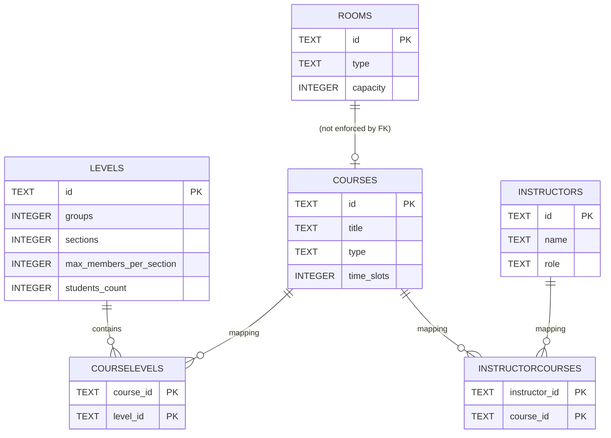
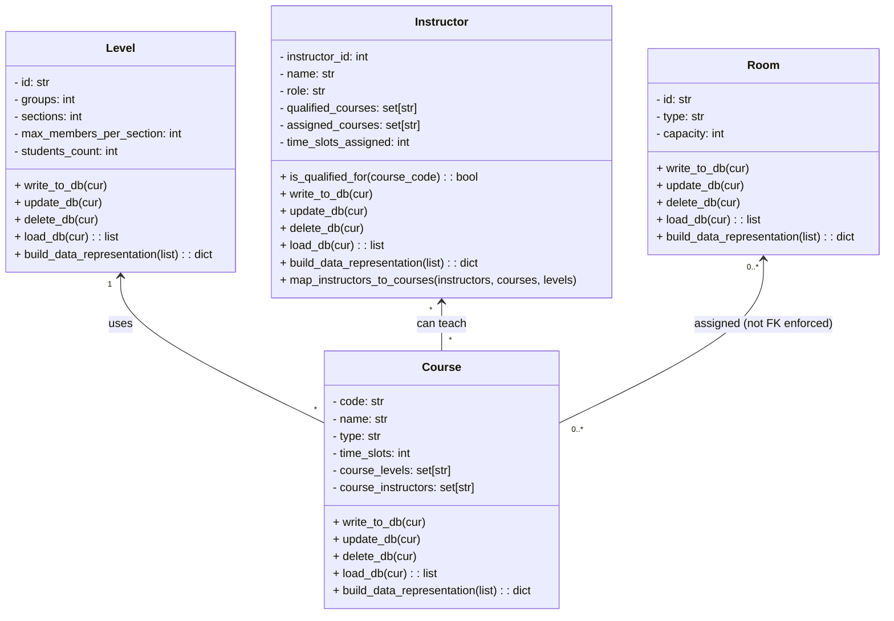
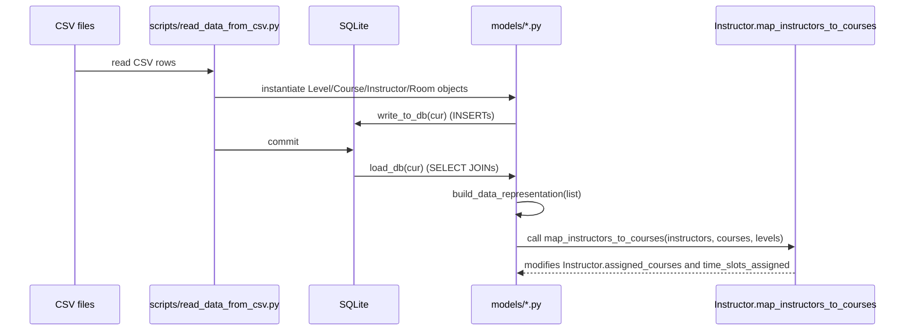

# Timetable Generator — Documentation

This document explains the Timetable Generator project: architecture, data model, database schema, class diagrams, sequence and flow diagrams, algorithm explanation, edge cases, and how to run and test the project.

## Table of contents

- Project overview
- File / package layout
- High-level architecture
- Database schema (ER diagram + table listing)
- Models and class diagram
- Key routines and algorithms
  - Instructor.map_instructors_to_courses (heap-based load balancing)
- Sequence & flow diagrams
- Edge cases and constraints
- Complexity analysis
- How to run and test
- Suggested improvements & next steps

## Project overview

This repository implements a simple timetable generator core that:

- Loads Levels, Courses, Instructors and Rooms from CSVs (scripts in `scripts/`).
- Writes the data into a SQLite database (`timetable.db`).
- Loads data from the database into Python model objects (`models/*.py`).
- Runs an assignment algorithm to map instructors to courses while balancing instructor load.

The repository contains simple I/O utilities, model classes, a DB creation script, and unit tests.

## File / package layout

- `create_db_tables.py` — creates SQLite tables (used by `scripts/` or manually).
- `main.py` — application entry point (project root).
- `models/` — model classes for `Course`, `Instructor`, `Level`, `Room`.
- `scripts/` — CSV readers and DB writers.
- `test/` — unit tests for models and algorithm logic.

## High-level architecture

- Data sources (CSV files) -> `scripts/read_data_from_csv.py` -> model objects -> `scripts/write_data_into_db.py` -> SQLite DB.
- Application loads data from DB using `Model.load_db()` methods.
- `Model.build_data_representation()` converts lists to maps used by the algorithm.
- Algorithm `Instructor.map_instructors_to_courses` assigns instructors to courses using a max-heap (negated min-heap) to prefer least-loaded instructors.

## Database schema (ER diagram + table listing)

The DB schema is defined in `scripts/create_db_tables.py`. Key tables and columns:

- Levels(id PRIMARY KEY, groups, sections, max_members_per_section, students_count DEFAULT 0)
- Courses(id PRIMARY KEY, title, type CHECK(...), time_slots)
- CourseLevels(course_id, level_id) — PK (course_id, level_id), FKs -> Courses(id), Levels(id)
- Instructors(id PRIMARY KEY, name, role)
- InstructorCourses(instructor_id, course_id) — PK (instructor_id, course_id), FKs -> Instructors(id), Courses(id)
- Rooms(id PRIMARY KEY, type CHECK(...), capacity)

ER diagram (Mermaid):



Notes:
- `CourseLevels` and `InstructorCourses` are pure association tables and use composite primary keys.
- Foreign keys use `ON DELETE CASCADE` so deleting a parent row removes associations.

## Models and class diagram

The primary model classes are `Level`, `Room`, `Course`, and `Instructor` (found in `models/`). Each model implements basic CRUD helpers (write_to_db, update_db, delete_db) and a `load_db` classmethod that reads rows and returns objects.

Mermaid class diagram:



Notes on model linking:
- `Course.load_db()` performs an INNER JOIN across `CourseLevels` and `InstructorCourses` so a Course is only returned if it has at least one level and one instructor in the DB rows returned.
- `Instructor.load_db()` queries `InstructorCourses` and groups rows by instructor.

## Key routines and algorithms

The most important algorithm is `Instructor.map_instructors_to_courses`. It assigns instructors to courses while attempting to balance total teaching time-slots assigned per instructor.

Contract (inputs/outputs):

- Inputs: instructors: dict[id->Instructor], courses: dict[name->Course], levels: dict[id->Level]
- Output: modifies Instructor objects in-place: `assigned_courses` and `time_slots_assigned`; Course objects get `course_assigned_instructors` updated.
- Error modes: missing level ids in `levels` will raise KeyError in current implementation; missing instructors in course.course_instructors will be ignored.

Summary of algorithm steps:

1. For each course in `courses.values()`:
   - Determine how many instructors should be assigned: 
     - `Graduation` -> skip (no assignment)
     - `Lecture` -> 1 instructor
     - `Japanese` -> 3 instructors
     - other (Labs/Tutorials) -> 2 instructors
   - Create a max-heap (implemented via `heapq` with negated values) called `least_loaded_heap`.
   - For each instructor id in `course.course_instructors`, push a tuple `(-time_slots_assigned, instructor_id)` to the heap using `_insert_to_heap` which maintains the heap size <= required instructors.
   - After filling the heap, call `_assign_course_to_instructors` to add the course name to each selected instructor's `assigned_courses` and increase `time_slots_assigned` by a computed amount.

Time-slot calculation details:

- For each level in `course.course_levels`:
  - If course.type.lower() == "lecture": time_slots += course.time_slots * levels[level_id].groups
  - Else (labs/tutorials/etc): time_slots += course.time_slots * levels[level_id].sections

Example: Course C with time_slots=2, type=Lecture, levels L1 (groups=2), L2 (groups=1) -> total instructor time slots = 2*(2 + 1) = 6.

Pseudocode (simplified):

```
for course in courses:
    if course.type == 'Graduation': continue
    instructors_needed = determine_by_type(course.type)
    use heap to pick instructors_needed instructors with smallest time_slots_assigned
    for selected_instructor:
        selected_instructor.assigned_courses.add(course.name)
        selected_instructor.time_slots_assigned += compute_time_slots(course, levels)
```

Edge behavior to be aware of:

- If `course.course_instructors` contains fewer instructors than required, the heap logic still selects up to that many available — effectively assigning the course to as many instructors as available.
- If a `level_id` in `course.course_levels` does not exist in `levels`, the code will raise KeyError when computing time_slots.

## Sequence & flow diagrams

1) CSV -> DB -> Load -> Algorithm (Mermaid sequence):



2) `map_instructors_to_courses` flowchart (Mermaid flowchart):

```mermaid
flowchart TD
    A[Start: iterate courses] --> B{course.type}
    B -- Graduation --> C[skip]
    B -- Lecture --> D[need 1 instructor]
    B -- Japanese --> E[need 3 instructors]
    B -- other --> F[need 2 instructors]
    D --> G[fill heap with instructors (negated timeslots)]
    E --> G
    F --> G
    G --> H[selected instructors in heap]
    H --> I[assign course to each instructor]
    I --> J[increase instructor.time_slots_assigned]
    J --> K[next course]
    C --> K
    K --> L[End]
```

## Edge cases and constraints

- Missing levels referenced by a course: current code expects `levels[level_id]` to exist. Recommendation: validate levels when loading and either skip the course or log and continue.
- Courses with zero instructors: after `Course.load_db()` such courses may be omitted because of INNER JOIN; verify CSV input ensures at least one instructor per course or change load query to LEFT JOINs and handle missing instructors explicitly.
- Insufficient available instructors for required count (e.g., Japanese needs 3): algorithm will assign fewer instructors if not enough qualified instructors exist; consider warning/logging in such cases.
- `Room.build_data_representation` currently assumes nested dicts exist when adding rooms and will raise a KeyError. The code:

    rooms_m[room.type][room.capacity].add(room)

  is unsafe unless `rooms_m[room.type]` exists and `rooms_m[room.type][room.capacity]` is initialized. Suggestion: initialize dictionaries/sets before adding or use defaultdict.

## Complexity analysis

- Let C = number of courses, I = number of instructors per course (avg), L = number of levels per course.
- For each course, the algorithm pushes at most I items into a heap of size at most K (K is instructors_needed: 1,2 or 3). Each push/pop is O(log K) which is constant (K <= 3) — effectively O(I).
- Time-slot calculation iterates levels per course: O(L).
- Overall complexity: O(sum_over_courses (I + L)) — linear in the input size given small constants for K.

## How to run and test

1) Create the DB (optional — scripts use `timetable.db` in project root):

```bash
# From project root
python3 scripts/create_db_tables.py
```

2) Populate DB from CSVs (if you have CSVs and the scripts expect their names):

```bash
python3 scripts/read_data_from_csv.py
python3 scripts/write_data_into_db.py
```

3) Run the application (if `main.py` is wired up):

```bash
python3 main.py
```

4) Run tests using unittest (the repository has `test/model_tests.py`):

```bash
python3 -m unittest discover -v
```

Notes about tests: `test/model_tests.py` sets up an in-memory SQLite database so running tests is safe and does not modify `timetable.db`.

## Suggestions, known issues & next steps

- Fix `Room.build_data_representation` to initialize nested dicts/sets using `defaultdict(lambda: defaultdict(set))` or explicit checks.
- Harden `map_instructors_to_courses` by:
  - logging warnings when a course references unknown levels or has too few qualified instructors,
  - optionally raising or returning diagnostics for post-processing.
- Expand unit tests to cover:
  - Courses with missing levels or instructors,
  - The heap-selection behavior when instructors have different `time_slots_assigned` values,
  - `Room.build_data_representation` behavior and expected outputs.
- Add type hints and mypy/flake8 linting to improve maintainability.
- Add a simple CLI to run the assignment algorithm and produce an output report (CSV/JSON) of assignments.

## Completion summary

- Added a full `DOCUMENTATION.md` describing architecture, DB design, classes, algorithms, diagrams, and run/test instructions.
- Included Mermaid diagrams (class, ER, sequence, flow).

If you'd like, I can also:

- Render the Mermaid diagrams into PNG/SVG files and add them to the repo.
- Add more detailed examples with sample data and expected output (CSV/JSON) from the assignment algorithm.

---

Last updated: (auto-generated) — see commit history for details.
